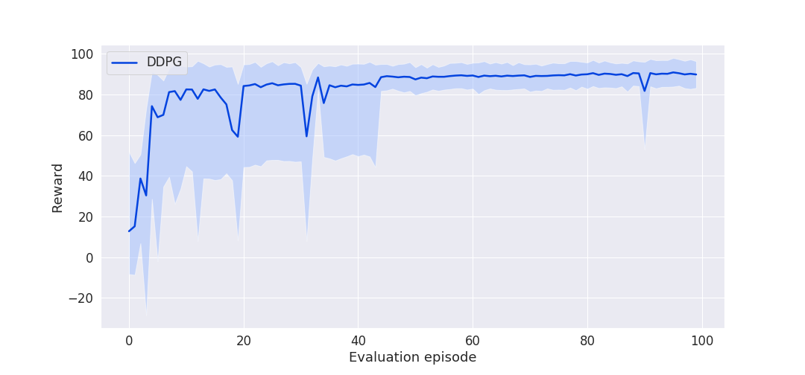
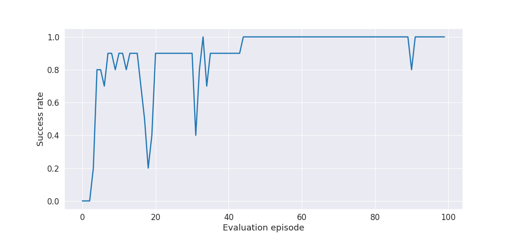

# Mobile robot control using Deep Reinforcement Learning
### Short description
Following project was a part of my master thesis. Current version is a little bit modified and 
much improved. The project is using modified algorithm Deterministic Policy Gradient 
(Lillicrap et al.[arXiv:1509.02971](https://arxiv.org/pdf/1509.02971.pdf)) 
(written in Tensorflow) to control mobile robot. The main idea was to learn mobile robot navigate
 to goal and also avoid obstacles. For obstacles avoidance, robot is using 5 ultrasonic sensors. 
 For navigation task, required information (like absolute pose) are taken from simulation
  engine. That's a little hack. However, more realistic (like odometry) pose estimation can be 
  found in [gym-vrep](https://github.com/Souphis/gym-vrep).

# How to use
## Dependencies
### Simulation
Project is using robotic simulation [V-REP EDU](http://www.coppeliarobotics.com/). To setup V-REP
 environment follow instruction described in [gym-vrep](https://github.com/Souphis/gym-vrep) 
 repository.

### Python
All Python dependencies are in `requirements.txt`. Just run command:

```
pip install -r requirements.txt
```


## Running
To run training just run command:

```
python main.py --train
```

To run testing just run command:

```
python main.py
```

For more options (like state, action normalization) run command:

```
python main.py --help
```

# Result
Agent was learned for 1000 episodes and results are shown below:





