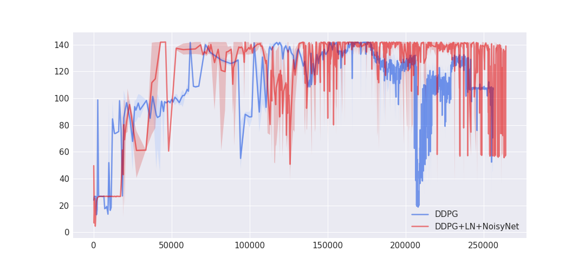

# Mobile robot control using Deep Reinforcement Learning
Following project was a part of my master thesis. Current version is a little bit modified.
The project is using modified algorithm Deterministic Policy Gradient (Lillicrap et al.[arXiv:1509.02971](https://arxiv.org/pdf/1509.02971.pdf)) (written in Tensorflow) to control mobile robot.

## Short description
Project contains (for now) four environments:
  * *no_obstacles* - env without any obstacles, random genrated goal for robot,
  * *room* - env with walls between robot and target goal,
  * *room_four_goals* - env with four respawn positions and correspoding them target goals, walls between robot and target goal
  * *moving_obstacles* - env with walls and moving obstacles between robot and target goal
  
Model description:
  * **agent** - mobile robot
  * **states** - reading from five ultrasonic rangefinders, polar coordinates
  * **actions** - two motors velocities

# How to use
## Dependencies
### Simulation
Project is using robotic simulation [V-REP EDU](http://www.coppeliarobotics.com/). Files in `./environment/vrep/`
are property of Coppelia Robotics GmbH.
Download V-REP from website and moved it somwhere in disk (i.e. `/opt/V-REP`)
To run project environment variable must be created:

```
V_REP=/path_to_vrep/
```

### Python
All Python dependencies are in `requirements.txt`. Just run command:

```
pip install -r --no-cache-dir --upgrade requirements.txt
```


## Running
To run training just run command:

```
python main.py --train
```

To run testing just run command:

```
python main.py --test --viz
```

For more options (like state, action normalization) run command:

```
python main.py --help
```


# Result
Training was run for 1000 episodes (over 500k steps). Robot is achieving target goal.



